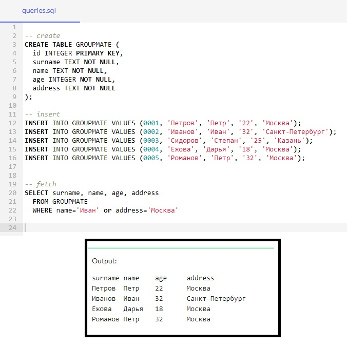

**Задача №1:**

Создать БД, состоящую из одной таблицы (информация об одногруппниках) с четырьмя полями (добавить поле «Адрес»): id, name, age, address.

>*-- create*
>
>**CREATE TABLE** GROUPMATE **(**
>
>id INTEGER **PRIMARY KEY**,
>
>surname TEXT **NOT NULL**,
>
>name TEXT **NOT NULL**,
>
>age INTEGER **NOT NULL**,
>
>address TEXT **NOT NULL**
>
>**);**
>
>*-- insert*
>
>**INSERT** INTO GROUPMATE VALUES (0001, 'Петров', 'Петр', '22', 'Москва');
>
>**INSERT** INTO GROUPMATE VALUES (0002, 'Иванов', 'Иван', '32',
'Санкт-Петербург');
>
>**INSERT** INTO GROUPMATE VALUES (0003, 'Сидоров', 'Степан', '25', 'Казань');
>
>**INSERT** INTO GROUPMATE VALUES (0004, 'Ежова', 'Дарья', '18', 'Москва');
>
>**INSERT** INTO GROUPMATE VALUES (0005, 'Романов', 'Петр', '32', 'Москва');
>
>*-- fetch*
>
>**SELECT** surname, name, age, address
>
> **FROM** GROUPMATE
>
>   **WHERE** name='Иван' **OR** address='Москва'

:point_right: [Перейти mysql онлайн ](https://onecompiler.com/mysql/3ysqhgccr "Перейти")

---

:point_right: [Скрин решения](https://github.com/ANT050/Homework_20.12.2022-web/blob/main/Task_2/1.jpg "Открыть")

---

:point_right: [Вначало](#return "Вернуться вначало")